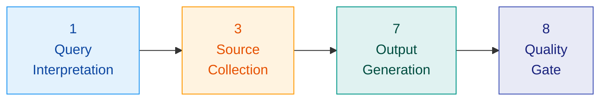
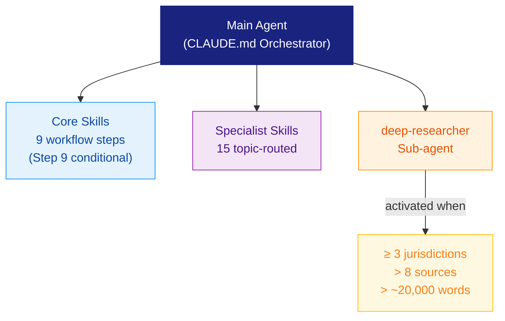

<div align="center">

# General Legal Research Agent

**Evidence-based international legal research workflow, powered by Claude Code.**

[](LICENSE)
[](https://claude.ai/code)
[](https://python.org)
[](#jurisdiction-coverage)

**[How to Use](docs/en/how-to-use.md)** · **[Disclaimer](docs/en/disclaimer.md)** · **[MCP Setup Guide](docs/en/mcp-setup-guide.md)**
· **[Citation Audit Spec](docs/citation-audit.md)** · **[Release Process](docs/release-process.md)**

**Language:** [**English**](README.md) | [한국어](docs/ko/README.md)

</div>

> Latest release: **[v1.1.0 — Citation Audit: Standalone + Memo/Opinion Workflow (2026-04-24)](docs/releases/v1.1.0.md)**

---

## Table of Contents

- [Overview](#overview)
- [Example Outputs](#example-outputs)
- [Core Design Principles](#core-design-principles)
- [Workflow](#workflow)
- [Personal Configuration](#personal-configuration)
- [Output Modes](#output-modes)
- [Architecture](#architecture)
- [Source Reliability & Citation Model](#source-reliability--citation-model)
- [Citation Audit](#citation-audit--two-invocation-contexts)
- [Release Process](#release-process)
- [Jurisdiction Coverage](#jurisdiction-coverage)
- [Repository Structure](#repository-structure)
- [How to Use](#how-to-use)
- [Development Roadmap](#development-roadmap)

---

## Overview

`General Legal Research Agent` is a Claude Code agent scaffold that performs structured, source-grounded legal research across any practice area and jurisdiction. It runs entirely within your local Claude Code session with no external backend required.

The agent is configurable per user. On first launch, a brief setup wizard collects your name, role, organization, practice area, and jurisdiction preferences, then saves them locally as `user-config.json`. Every subsequent session loads this config automatically, personalizing the agent's persona, jurisdiction defaults, and output language without any manual steps.

> [!IMPORTANT]
> This project is **not** designed to provide legal advice.

## Example Outputs

| Example | Description |
|:--------|:------------|
| [English output](https://docs.google.com/document/d/1HTXCMYERDhHlm40_zSqMrIWATJPTBPOW/edit?usp=sharing&ouid=105178834220477378953&rtpof=true&sd=true) | Deepfake regulation across five jurisdictions (KR, EU, US, JP, UK) |

---

## Core Design Principles

| Principle | Description |
|:----------|:------------|
| **No Hallucination** | No legal claim without a verifiable, pinpoint-cited source |
| **Source Hierarchy** | Primary sources (statutes, cases, agency documents) over secondary; low-trust blogs/wikis excluded as sole basis |
| **Citation Integrity** | Every key conclusion traces back to a directly-fetched primary source; source laundering prevention enforced |
| **Uncertainty Transparency** | All unresolved findings tagged `[Unverified]` or `[Unresolved Conflict]` |
| **Jurisdiction-First** | Official portals fetched directly — `law.go.kr` (via korean-law MCP + Open Law API), `eur-lex.europa.eu`, `congress.gov`, and others |

---

## Workflow

### Standard Mode — 8 Steps + conditional Step 9

```mermaid
flowchart LR
    S0["0\nConfig\nLoading"] --> S1["1\nQuery\nInterpretation"]
    S1 --> S2["2\nJurisdiction\nMapping"]
    S2 --> S3["3\nSource\nCollection"]
    S3 --> S4["4\nFact-Check,\nCross-Check &\nLaundering"]
    S4 --> S5["5\nReliability\nScoring"]
    S5 --> S6["6\nAnalysis &\nStructuring"]
    S6 --> S7["7\nOutput\nGeneration"]
    S7 --> S8["8\nQuality\nGate"]
    S8 -.memo/opinion.-> S9["9\nCitation\nAudit"]

    style S0 fill:#e8f5e9,stroke:#4caf50,color:#1b5e20
    style S1 fill:#e3f2fd,stroke:#2196f3,color:#0d47a1
    style S2 fill:#e3f2fd,stroke:#2196f3,color:#0d47a1
    style S3 fill:#fff3e0,stroke:#ff9800,color:#e65100
    style S4 fill:#fce4ec,stroke:#e91e63,color:#880e4f
    style S5 fill:#fff3e0,stroke:#ff9800,color:#e65100
    style S6 fill:#f3e5f5,stroke:#9c27b0,color:#4a148c
    style S7 fill:#e0f2f1,stroke:#009688,color:#004d40
    style S8 fill:#e8eaf6,stroke:#3f51b5,color:#1a237e
    style S9 fill:#fff8e1,stroke:#fbc02d,color:#f57f17
```



| Step | Name | Output |
|:----:|:-----|:-------|
| **0** | User Config Loading | Loads `user-config.json`; auto-triggers `/onboard` if missing |
| **1** | Query Interpretation & Parameter Resolution | Structured parameters and assumptions |
| **2** | Jurisdiction Mapping & Research Plan | Jurisdiction profile, domain checklist, search plan |
| **3** | Source Collection | Raw sources with metadata (Korean law via korean-law MCP Server + Open Law API; PDF/DOCX via MarkItDown; HWP/HWPX via kordoc) |
| **4** | Factual Claim Spot-Check, Similar-Statute Cross-Check & Source Laundering Detection | `claim-registry.json` — Verified / Unverified / Contradicted per anchor, similar-statute disambiguation |
| **5** | Source Reliability Scoring (A–D) | Graded source list with rationale |
| **6** | Analysis & Issue Structuring | Issue tree, conflict report, glossary updates |
| **7** | Output Generation (Mode A/B/C/D) | Inline preview, then file on confirmation |
| **8** | Quality-Gate Self-Verification | Pass/fail plus remediation instructions |
| **9** | Citation Audit *(conditional)* | Auto-runs for Mode B/C/D or memo/opinion deliverables; dispatches per-jurisdiction verifiers and folds a **검증 로그 (Citation Audit Log)** appendix into the final artifact. Skipped for Mode A briefs. |

### Quick Mode — 4 Steps

> For simple, single-jurisdiction statute lookups where extra steps add no value.



> [!TIP]
> Session state is checkpointed at the end of every step in `output/checkpoint.json`. Interrupted sessions can be resumed automatically.

---

## Personal Configuration

The agent is designed for single-user local installation. Configure it once for your own practice, much like setting up a custom GPT or Claude Project.

### How It Works

**First session (automatic):** If `user-config.json` does not exist, Step 0 triggers the setup wizard automatically before research begins. No need to run `/onboard` manually.

**Setup options:**

| Option | Description |
|:------:|:------------|
| **[1] Starter Template** | Pick one of 6 presets and start immediately |
| **[2] Custom Interview** | Answer 7 questions to configure every field |

<details>
<summary><strong>Starter Templates</strong></summary>

| # | Template | Primary Jurisdiction | Output Language |
|:-:|:---------|:---------------------|:----------------|
| 1 | Korean General Statute | KR | Korean |
| 2 | Korean Startup / VC / Tech | KR (+ US, SG) | Korean |
| 3 | Korean IP Litigation | KR (+ US, EU, JP) | Korean |
| 4 | Korean Employment & Labor | KR | Korean |
| 5 | US Corporate & M&A | US | English |
| 6 | EU Privacy & GDPR | EU (+ UK, US, KR) | English |

</details>

> [!NOTE]
> **Reconfiguration:** Run `/onboard` at any time to update your settings. The wizard shows your current config and asks for confirmation before overwriting it.

### Local-Only Files (gitignored)

All user-specific data stays on your machine and is never committed to git:

| Path | Managed By | Purpose |
|:-----|:-----------|:--------|
| `user-config.json` | Auto-generated by `/onboard` | Persona, jurisdiction defaults, output preferences |
| `knowledge/` | Agent (post-research) | Cached research results, statute digests, verified source snapshots |
| `library/` | `/ingest` + on-demand API cache | Drop files in `inbox/`, auto-grade them into `grade-a/`, `grade-b/`, `grade-c/`, and persist fetched statutes/cases into `grade-a/` via `--save` |

<details>
<summary><strong><code>user-config.json</code> schema</strong></summary>

```json
{
  "version": "1.0",
  "persona": {
    "name": "Jane Smith",
    "title": "Research Specialist",
    "firm": "KP Legal Orchestrator",
    "bar_admissions": ["US-NY"],
    "specialization": "US Corporate & M&A"
  },
  "practice": {
    "primary_area": "corporate",
    "sub_areas": ["MA_transactions", "PE_VC"],
    "industry_sectors": ["technology", "healthcare"],
    "typical_matters": ["merger_agreement_review", "due_diligence"]
  },
  "jurisdictions": {
    "primary": ["US"],
    "secondary": ["EU", "KR"]
  },
  "research_defaults": {
    "mode": "D",
    "output_format": "docx",
    "output_language": "en"
  },
  "kb": { "index_path": "knowledge/_index.md" },
  "library": { "index_path": "library/_index.md" }
}
```

</details>

<details>
<summary><strong><code>library/</code> directory</strong></summary>

Drop source files into `library/inbox/` and run `/ingest`. The agent automatically converts supported files to Markdown, classifies their reliability grade (A/B/C), generates metadata frontmatter, and places them into the appropriate graded folder. Grade A sources are prioritized during Step 3 research.

Supported ingest formats:

- `PDF`, `DOCX`, `PPTX`, `XLSX`, `HTML` via MarkItDown
- `HWP`, `HWPX` via `kordoc`
- `MD`, `TXT` as passthrough

On-demand API fetches use the same `library/grade-a/` area. `open_law_api.py --save` and `eurlex_api.py --save` persist primary law materials there as Markdown or JSON so future sessions can reuse them locally. The `korean-law` MCP server provides real-time access to the same law.go.kr data with 64 tools, but uses in-memory caching; use the Python script for persistent file-based caching.

```text
library/
|-- _index.md              # auto-generated by ingest
|-- inbox/                 # drop files here
|   |-- _processed/        # originals moved here after processing
|   `-- _failed/           # conversion failures
|-- grade-a/               # primary sources + on-demand API cache
|-- grade-b/               # secondary sources (case law, firm commentary)
`-- grade-c/               # academic / reference materials
```

</details>

<details>
<summary><strong>Adding Your Own Sources</strong></summary>

1. Drop any file (PDF, DOCX, PPTX, etc.) into `library/inbox/`
2. Tell the agent: `/ingest` or "자료 넣었어"
3. The agent will automatically:
   - Convert to structured Markdown (PDF/DOCX/PPTX via MarkItDown; HWP/HWPX via kordoc)
   - Classify source grade (A/B/C) based on content signals
   - Generate YAML metadata (frontmatter)
   - Place in the appropriate `library/grade-{a,b,c}/` folder
   - Update `library/_index.md` and `knowledge/library-converted/`

**CLI alternative:** `python3 scripts/library-ingest.py`

> **Note:** Dropping files alone does not trigger processing.
> You must run `/ingest` or tell the agent (e.g., "inbox에 파일 넣었어")
> to start the parsing pipeline.

**Grade classification:**

| Grade | Accepted Sources |
|:-----:|:-----------------|
| **A** | Statutes, enforcement decrees, government guidelines, official gazettes |
| **B** | Case law, regulatory decisions, law firm newsletters, legal columns |
| **C** | Academic papers, law review articles, commentaries, treatises |
| **D** | News, AI summaries, wikis — **rejected** (not ingested) |

</details>

<details>
<summary><strong><code>knowledge/</code> directory</strong></summary>

Agent-generated. After each research session, the agent stores verified findings, statute excerpts, and source metadata here for reuse in future sessions.

```text
knowledge/
|-- _index.md          # maintained by the agent
|-- statutes/
|-- cases/
|-- templates/
|-- precedents/
`-- library-converted/ # auto-generated from library/ PDFs/DOCX
```

</details>

---

## Output Modes

| Mode | Type | Default Format | Best For |
|:----:|:-----|:---------------|:---------|
| **A** | Executive Brief | `.md` | Quick summaries for decision-makers |
| **B** | Comparative Matrix | `.md` | Multi-jurisdiction side-by-side analysis |
| **C** | Enforcement & Case Law | `.md` | Litigation strategy and precedent review |
| **D** | Black-letter & Commentary | `.docx` | Comprehensive statute-level research *(default)* |

Supported output formats: `.md` · `.docx` · `.pdf` · `.pptx` · `.html` · `.txt`

> For legal opinion deliverables (`legal opinion`, `opinion letter`, `formal opinion memo`), the `legal-opinion-formatter` skill generates an A4 professional-format document with `python-docx`.

---

## Architecture



### Core Skills (Steps 0–8 + conditional Step 9)

| Skill | Step | Role |
|:------|:----:|:-----|
| `onboard` | 0 | User profile setup & config loading |
| `query-interpreter` | 1 | Parse natural language into structured parameters |
| `jurisdiction-mapper` | 2 | Map jurisdictions & build research plan |
| `web-researcher` | 3 | Collect sources (Korean law via korean-law MCP + Open Law API; others via search/fetch) |
| `fact-checker` | 4 | Verify claims, cross-check similar statutes & detect source laundering |
| `source-scorer` | 5 | Grade sources A–D with rationale |
| `conflict-detector` + `glossary-manager` | 6 | Analyze issues & manage legal terminology |
| `output-generator` | 7 | Render deliverable in chosen format |
| `quality-checker` | 8 | 14-item quality gate verification |
| `citation-auditor` | 9 *(conditional)* | Dispatches per-jurisdiction verifier subagents; folds a 검증 로그 appendix into memo/opinion deliverables |

### Specialist Skills (routed by topic)

<details>
<summary><strong>View all 15 specialist skills</strong></summary>

| Skill | Trigger Topic |
|:------|:--------------|
| `legal-opinion-formatter` | Legal opinion, opinion letter, formal opinion |
| `legal-research` | Research methodology, authority validation |
| `legal-research-summary` + `client-memo` | Research digest, memo output |
| `regulatory-summary` + `compliance-summaries` | Market entry, regulator obligations |
| `gambling-law-summary` | Gambling, loot boxes, gaming licensing |
| `privacy-law-updates` + `cyber-law-compliance-summary` | Data / privacy |
| `antitrust-investigation-summary` | Antitrust / competition |
| `ip-infringement-analysis` | IP enforcement, dispute risk |
| `terms-of-service` + `api-acceptable-use-policy` | Platform / user policy terms |
| `judgment-summary` + `case-briefs` | Case-law synthesis |

</details>

---

## Source Reliability & Citation Model

### Reliability Grades

| Grade | Description | Examples |
|:-----:|:------------|:---------|
| **A** | Official primary source | Statutes, cases, agency documents, `library/` uploads |
| **B** | High-quality secondary | Peer-reviewed work, major practitioner publications; unofficial translations capped at B |
| **C** | Medium reliability | Requires bias note |
| **D** | Low reliability | Cannot be sole basis for any conclusion |

### Source Authority Classification

Every source is independently classified as `primary` (official original text), `secondary` (interpretation/commentary), or `mixed` (both). Key conclusions require at least one directly-fetched `primary` source at Grade A or B. Secondary sources flagged with `laundering_risk` cannot be cited as primary authority.

### Source Priority Registry

Jurisdiction-specific source priority is centralized in `legal_sources.yaml`. Query or validate it with:

```bash
python3 scripts/legal_source_registry.py validate
python3 scripts/legal_source_registry.py show KR --korean-law-mcp-available false
```

The registry keeps Korean-law MCP, Open Law API, EUR-Lex, and official portal fallback order in one place so workflow prompts and verifier behavior do not drift.

### Citation Codes

| Code | Type |
|:----:|:-----|
| `[P#]` | Legislation / Regulation |
| `[T#]` | Treaty / Convention |
| `[C#]` | Case Law / Decision |
| `[A#]` | Administrative Document |
| `[S#]` | Secondary Source |

**Special tags:** `[Industry Self-Regulatory Body]` · `[Unverified]` · `[Unresolved Conflict]`

---

## Jurisdiction Coverage

> Official legal portals pre-approved for direct fetch — **17+ jurisdictions**

| Region | Portal |
|:-------|:-------|
| **Korea** | `law.go.kr` (korean-law MCP: 64 tools incl. tribunals, chain research, annexes + Open Law API CLI for file caching) · `supremecourt.go.kr` |
| **EU** | `eur-lex.europa.eu` (EUR-Lex SOAP API — regulations, directives, CJEU case law) |
| **US** | `congress.gov` · `ecfr.gov` · `federalregister.gov` |
| **UK** | `legislation.gov.uk` |
| **Germany** | `gesetze-im-internet.de` |
| **Japan** | `laws.e-gov.go.jp` · `moj.go.jp` |
| **France** | `legifrance.gouv.fr` |
| **Spain** | `boe.es` |
| **Italy** | `gazzettaufficiale.it` |
| **China** | `flk.npc.gov.cn` |
| **Singapore** | `sso.agc.gov.sg` |
| **Australia** | `legislation.gov.au` |
| **Canada** | `laws-lois.justice.gc.ca` |
| **Brazil** | `planalto.gov.br` |

Additional practitioner/commentary sources are listed in `.claude/skills/web-researcher/references/legal-source-urls.md`.

---

## Repository Structure

<details>
<summary><strong>View full directory tree</strong></summary>

```text
/project-root
|-- CLAUDE.md                          # main orchestrator (start here)
|-- user-config.json                   # gitignored; auto-generated by /onboard
|-- .gitignore
|-- legal_sources.yaml                  # canonical source-priority registry
|-- .mcp.json                          # MCP server config (korean-law MCP)
|-- .env.example                       # MCP API key template
|-- .claude/
|   |-- settings.json                  # auto-ingest hook
|   |-- settings.local.json            # WebFetch domain allowlist
|   |-- routing/
|   |   |-- skills.yaml                 # compact skill routing table
|   |   `-- fixtures.yaml              # representative routing validation fixtures
|   |-- commands/
|   |   `-- audit.md                   # /audit slash command entry point
|   |-- agents/
|   |   `-- deep-researcher/AGENT.md
|   `-- skills/
|       |-- onboard/                   # /onboard skill + 6 starter templates
|       |-- ingest/                    # /ingest skill — inbox → grade classification
|       |-- query-interpreter/
|       |-- jurisdiction-mapper/
|       |-- web-researcher/
|       |-- source-scorer/
|       |-- conflict-detector/
|       |-- glossary-manager/
|       |-- output-generator/
|       |-- quality-checker/
|       |-- legal-opinion-formatter/   # includes python-docx generator
|       |-- citation-auditor/          # /audit skill; also workflow Step 9
|       |-- verifiers/                 # per-jurisdiction verifier plugins (kr/us/eu/uk/scholarly/wikipedia/general-web)
|       `-- [15 specialist skills]/
|-- citation_auditor/                  # Python package backing citation-auditor (chunking, aggregation, render)
|-- knowledge/                         # gitignored; agent-generated KB
|   |-- _index.md
|   |-- statutes/
|   |-- cases/
|   |-- templates/
|   `-- precedents/
|-- library/                           # gitignored; source materials (graded A/B/C)
|   |-- _index.md                     # auto-generated by ingest
|   |-- inbox/                        # drop files here, then /ingest
|   |   |-- _processed/
|   |   `-- _failed/
|   |-- grade-a/                      # primary sources + on-demand API cache
|   |-- grade-b/                      # secondary sources (case law, commentary)
|   `-- grade-c/                      # academic / reference
|-- index/                             # cache indexes for on-demand law saves
|   |-- article-index.json
|   |-- source-registry.json
|   `-- cross-refs-reverse.json
|-- scripts/
|   |-- legal_store.py                   # atomic law cache persistence + lookup/index sync
|   |-- open_law_api.py                  # Korean Open Law API CLI wrapper (on-demand)
|   |-- eurlex_api.py                    # EUR-Lex SOAP API CLI wrapper (on-demand)
|   |-- legal_source_registry.py          # legal_sources.yaml validator/query helper
|   |-- release.py                       # release note/tag/docs preflight helper
|   |-- validate_routing.py              # routing table + fixture validator
|   |-- citation_audit_backend.py        # Step 9 registry/metadata enrichment
|   |-- install-agentskills-set.ps1
|   |-- library-ingest.py                # inbox → grade classification + Markdown conversion
|   |-- render_professional_legal_opinion_docx.py
|   |-- render_acp_comparison_docx.py
|   `-- docx_citation_appendix.py        # Step 9 consumer adapter — folds citation audit into DOCX
|-- references/
|   |-- korean-law-reference.md        # Korean law research guide
|   |-- packs/
|   |   |-- api-acceptable-use-policy.md # API AUP drafting tables and template
|   |   |-- fact-checker.md            # Step 4 detailed verification reference pack
|   |   |-- ingest.md                  # /ingest conversion, grading, and placement rules
|   |   |-- onboard.md                 # /onboard templates, interview, and initialization rules
|   |   `-- web-researcher.md          # Step 3 source collection, fallback, and PDF/DOCX rules
|   `-- source-payload-contract.md     # sanitized retrieval envelope
|-- docs/
|   |-- citation-audit.md              # canonical citation audit spec
|   `-- release-process.md             # release preflight workflow
|-- output/
|   |-- glossary/glossary-global.json
|   `-- reports/                       # generated output files (gitignored)
`-- docs/
    |-- en/
    |   |-- README.md                  # compatibility bridge to root README
    |   |-- how-to-use.md
    |   |-- disclaimer.md
    |   `-- mcp-setup-guide.md
    |-- ko/
    |   |-- README.md
    |   |-- how-to-use.md
    |   |-- disclaimer.md
    |   `-- mcp-setup-guide.md
    |-- how-to-use.md                  # compatibility bridge
    |-- disclaimer.md                  # compatibility bridge
    `-- mcp-setup-guide.md             # compatibility bridge
```

</details>

Skill routing is centralized in `.claude/routing/skills.yaml` and covered by representative fixtures in `.claude/routing/fixtures.yaml`. After editing either file, run:

```bash
python3 scripts/validate_routing.py
```

---

## How to Use

### Requirements

| Requirement | Details |
|:------------|:--------|
| **Claude Code** | [CLI](https://claude.ai/code) installed and authenticated |
| **Python 3** | + `python-docx` for DOCX output, + `markitdown` for PDF/DOCX input conversion |
| **Node.js 18+** *(optional)* | Required only for HWP/HWPX ingest — `npx` auto-installs `kordoc` on first run |
| **MCP Keys** *(optional)* | See `.env.example` and [MCP Setup Guide](docs/en/mcp-setup-guide.md) |

### Quick Start

```bash
# 1. Clone and open
git clone <repo-url> && cd general-legal-research

# 2. Set up Python environment
python3 -m venv .venv && source .venv/bin/activate
pip install -r requirements.txt
# Optional: HWP/HWPX ingest support (requires Node.js 18+)
# No manual install needed — npx auto-downloads kordoc on first run

# 3. (Optional) Configure MCP search
cp .env.example .env   # then add your API keys

# 4. Launch Claude Code and ask your question
```

> [!TIP]
> **First session only:** the agent automatically runs the onboard setup wizard. Pick a starter template or answer 7 short questions (~2 min). This creates `user-config.json` locally.

### Korean Law MCP Server (64 Tools)

The project includes a pre-configured [`korean-law-mcp`](https://github.com/chrisryugj/korean-law-mcp) MCP server (`.mcp.json`) that provides 64 native tools for Korean law research:

| Category | Tools | Examples |
|:---------|:------|:---------|
| **Search** | 11 | `search_law`, `search_all`, `advanced_search`, `suggest_law_names` |
| **Retrieve** | 9 | `get_law_text`, `get_three_tier`, `compare_old_new`, `get_annexes` |
| **Analyze** | 9 | `get_law_tree`, `get_article_history`, `find_similar_precedents` |
| **Tribunals** | 10 | Constitutional Court, FTC, Tax Tribunal, PIPC, Labor Commission, etc. |
| **Knowledge Base** | 7 | Legal term dictionary, plain-language translation |
| **Chain Workflows** | 7 | `chain_full_research`, `chain_law_system`, `chain_dispute_prep` |

The MCP server uses in-memory caching (session-scoped). For persistent file-based caching, use the Python CLI below.

### On-Demand Legal Cache (File-Based)

- `python3 scripts/open_law_api.py get-law --id 001823 --save` caches a full Korean law snapshot into `library/grade-a/`.
- `python3 scripts/open_law_api.py get-article --id 001823 --article 39의3 --save` merges a single article into an existing cache without clobbering the rest of the law.
- `python3 scripts/open_law_api.py get-case --id 228541 --save` stores the case payload atomically under `library/grade-a/_cases/`.
- `python3 scripts/eurlex_api.py get-document 32016R0679 --save` stores the EUR-Lex document cache in the same Grade A area.
- Cache metadata is synchronized into `index/article-index.json`, `index/source-registry.json`, and `index/cross-refs-reverse.json`.
- Save operations use file locking and atomic replacement; corrupted index JSON aborts the save instead of partially overwriting cache state.

### Example Prompts

```text
Compare pseudonymization requirements under Korea's Personal Information Protection Act
with GDPR Article 4(5) and identify compliance gaps for a joint KR-EU data controller.
```

```text
Summarize US federal AI liability frameworks currently in effect or under active rulemaking.
```

```text
Analyze board approval requirements for a Delaware corporation acquiring a Korean subsidiary
via share purchase. Flag any CFIUS or FKFTC notification thresholds.
```

```text
Draft a formal opinion letter on whether our SaaS platform's data localization architecture
satisfies Brazil LGPD Article 33 cross-border transfer requirements.
```

### Citation Audit — Two Invocation Contexts

The citation-auditor runs in two distinct contexts:

**1. Workflow Step 9 (automatic)** — for memo/opinion deliverables, Step 9 runs after Step 8 and **folds a 검증 로그 (Citation Audit Log) appendix into the final saved artifact**. Triggers on Mode B/C/D or any `법률 의견서` / legal opinion request.

**2. Standalone `/audit` (manual)** — run a citation audit on any existing markdown file outside the workflow, including documents produced earlier or by other tools. Returns annotated markdown with inline per-claim badges and a per-claim audit report.

```bash
# Standalone audit (inline annotations)
/audit output/reports/my-opinion.md
```

Both contexts share the same verifier plugin family (`.claude/skills/verifiers/`) and aggregation pipeline. Forecasts, opinions, and rumors are intentionally skipped — the auditor only checks verifiable factual and citation claims.

For artifacts, detailed statuses, supported output formats, and Korean-law MCP degradation behavior, see the canonical [Citation Audit Spec](docs/citation-audit.md).

### Release Process

Before publishing a release, run:

```bash
python3 scripts/release.py validate vX.Y.Z --require-tag-at-head
```

See [Release Process](docs/release-process.md) for GitHub release body comparison and local preflight details.

### Local-Only vs MCP-Connected

| Mode | What Works | What Doesn't |
|:-----|:-----------|:-------------|
| **Local-only** | Open Law API for Korean statutes/cases/interpretations, direct URL fetch from whitelisted legal portals, skill dispatch, output generation, `library/` ingestion (PDF via `markitdown`, HWP/HWPX via `kordoc`) | Keyword search (`tavily` / `brave`), korean-law MCP tools |
| **MCP-connected** | Full workflow including korean-law MCP (64 tools for KR law), keyword search, PDF/DOCX URL conversion via `markitdown` MCP | Requires API keys in `.env` and Node.js for korean-law MCP |

---

## Development Roadmap

- [ ] Add repeatable integration tests for the 9-step workflow
- [ ] Expand conflict-resolution heuristics for more jurisdiction pairs
- [x] Integrate MarkItDown for PDF/DOCX input parsing (source collection, library ingestion, fact-checking)
- [x] Integrate Korean Open Law API for on-demand statute, case law, and interpretation retrieval
- [x] Integrate korean-law MCP server (64 tools — tribunals, chain research, annexes, 3-tier delegation)
- [ ] Add production MCP connectors to replace current script stubs
- [ ] Add CI schema validation for checkpoint and glossary JSON artifacts
- [ ] Expand `legal-source-urls.md` for additional jurisdictions (India, Netherlands, Mexico)
- [ ] Implement `/kb add`, `/kb search`, and `/kb status` for `knowledge/` management
- [ ] Auto-update `knowledge/_index.md` after Step 7 completes

---

## Part of KP Legal Orchestrator

This agent is part of the **KP Legal Orchestrator** series of specialist legal workflow agents:

| Agent | Role | Specialty |
|-------|------|-----------|
| [game-legal-research](https://github.com/kipeum86/game-legal-research) | Game Industry Specialist | Game industry law |
| [legal-translation-agent](https://github.com/kipeum86/legal-translation-agent) | Legal Translation Specialist | Legal translation |
| **[general-legal-research](https://github.com/kipeum86/general-legal-research)** | **Legal Research Specialist** | **Legal research** |
| [PIPA-expert](https://github.com/kipeum86/PIPA-expert) | Privacy Specialist (Korea) | Data privacy law |
| [GDPR-expert](https://github.com/kipeum86/GDPR-expert) | Privacy Specialist (EU) | Data protection law (GDPR) |
| [contract-review-agent](https://github.com/kipeum86/contract-review-agent) | Contract Specialist | Contract review |
| [legal-writing-agent](https://github.com/kipeum86/legal-writing-agent) | Legal Drafting Specialist | Legal writing |
| [second-review-agent](https://github.com/kipeum86/second-review-agent) | Senior Review Specialist | Quality review |

---

<div align="center">

## Disclaimer

This project supports legal research workflows. It does not provide legal advice.
For legal decisions, consult qualified counsel in the relevant jurisdiction.

---

**License:** [Apache 2.0](LICENSE)

</div>
