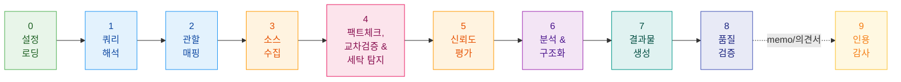
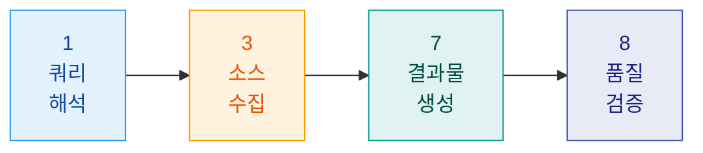
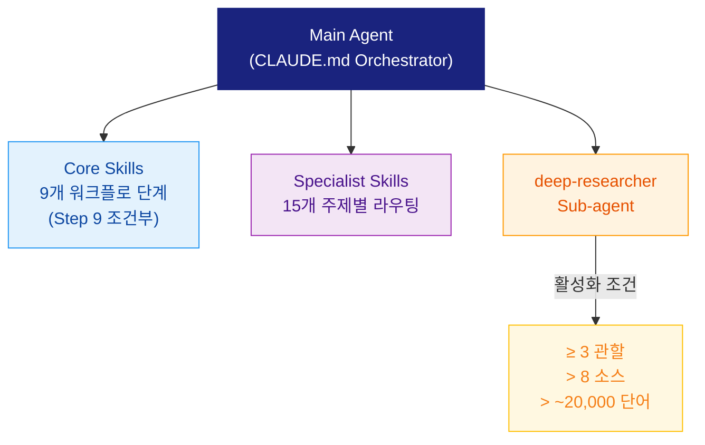

<div align="center">

# General Legal Research Agent

**Claude Code 기반의 증거 중심 해외 법령 리서치 워크플로우**

[](../../LICENSE)
[](https://claude.ai/code)
[](https://python.org)
[](#jurisdiction-coverage)

**[사용 가이드](how-to-use.md)** · **[면책조항](disclaimer.md)** · **[MCP 설정 가이드](mcp-setup-guide.md)**

**Language:** [English](../../README.md) | [**한국어**](README.md)

</div>

> 최신 릴리즈: **[v1.0.0 — 인용 감사: 스탠드얼론 + 메모/의견서 워크플로우 통합 (2026-04-24)](../releases/v1.0.0.md)**

---

## 목차

- [Overview](#overview)
- [Example Outputs](#example-outputs)
- [Core Design Principles](#core-design-principles)
- [Workflow](#workflow)
- [Personal Configuration](#personal-configuration)
- [Output Modes](#output-modes)
- [Architecture](#architecture)
- [Source Reliability & Citation Model](#source-reliability--citation-model)
- [Jurisdiction Coverage](#jurisdiction-coverage)
- [Repository Structure](#repository-structure)
- [How to Use](#how-to-use)
- [Development Roadmap](#development-roadmap)

---

## Overview

`General Legal Research Agent`는 실무 분야와 관할을 가리지 않고 구조화된, 출처 기반의 법률 조사를 수행하도록 설계된 Claude Code 에이전트 스캐폴드입니다. 외부 백엔드 없이 로컬 Claude Code 세션 안에서 작동합니다.

이 에이전트는 사용자별로 설정 가능합니다. 첫 실행 시 간단한 설정 마법사를 통해 이름, 역할, 조직명, 주요 업무 분야, 선호 관할을 수집하고 이를 `user-config.json`에 저장합니다. 이후 세션에서는 이 설정을 자동으로 불러와 에이전트의 페르소나, 기본 관할, 출력 언어를 별도 입력 없이 개인화합니다.

> [!IMPORTANT]
> 이 프로젝트는 **법률 자문을 제공하기 위한 도구가 아닙니다**.

## Example Outputs

| 예시 | 설명 |
|:-----|:-----|
| [English output](https://docs.google.com/document/d/1HTXCMYERDhHlm40_zSqMrIWATJPTBPOW/edit?usp=sharing&ouid=105178834220477378953&rtpof=true&sd=true) | Deepfake regulation across five jurisdictions (KR, EU, US, JP, UK) |

---

## Core Design Principles

| 원칙 | 설명 |
|:-----|:-----|
| **No Hallucination** | 검증 가능한 pinpoint citation 없이 법률 주장을 하지 않음 |
| **Source Hierarchy** | 1차 자료(법령, 판례, 행정문서)를 2차 자료보다 우선하며, 블로그/위키는 단독 근거로 사용 불가 |
| **Citation Integrity** | 모든 핵심 결론은 직접 수집한 1차 소스까지 추적 가능 — 소스 세탁 방지 적용 |
| **Uncertainty Transparency** | 미해결 쟁점은 모두 `[Unverified]` 또는 `[Unresolved Conflict]`로 표시 |
| **Jurisdiction-First** | `law.go.kr`(korean-law MCP + 열린법령 API), `eur-lex.europa.eu`, `congress.gov` 같은 공식 포털을 우선 직접 조회 |

---

## Workflow

### Standard Mode — 8단계 + 조건부 9단계



| Step | 단계명 | 산출물 |
|:----:|:-------|:-------|
| **0** | User Config Loading | `user-config.json` 로드, 없으면 `/onboard` 자동 실행 |
| **1** | Query Interpretation & Parameter Resolution | 구조화된 파라미터와 가정 |
| **2** | Jurisdiction Mapping & Research Plan | 관할 프로필, 쟁점 체크리스트, 검색 계획 |
| **3** | Source Collection | 메타데이터가 포함된 원문 소스 수집 (한국법은 korean-law MCP Server + 열린법령 API 우선; PDF/DOCX는 MarkItDown, HWP/HWPX는 kordoc으로 자동 변환) |
| **4** | Factual Claim Spot-Check, Similar-Statute Cross-Check & Source Laundering Detection | `claim-registry.json` — anchor별 Verified / Unverified / Contradicted + 유사법령 교차검증 + 소스 세탁 플래그 |
| **5** | Source Reliability Scoring (A–D) | 근거가 포함된 신뢰도 등급표 |
| **6** | Analysis & Issue Structuring | 쟁점 트리, 충돌 리포트, 용어집 업데이트 |
| **7** | Output Generation (Mode A/B/C/D) | 인라인 미리보기 후 확인 시 파일 생성 |
| **8** | Quality-Gate Self-Verification | 통과/실패 및 개선 지시 |
| **9** | Citation Audit *(조건부)* | Mode B/C/D 또는 memo/의견서 산출물에 대해 자동 실행 — 관할별 verifier 서브에이전트를 dispatch하고 **검증 로그 (Citation Audit Log)** 부록을 최종 산출물에 합침. Mode A는 스킵. |

### Quick Mode — 4단계

> 단일 관할의 간단한 법령 조회처럼 추가 단계가 불필요한 경우 자동으로 적용됩니다.



> [!TIP]
> 세션 상태는 각 단계 종료 시 `output/checkpoint.json`에 자동 저장됩니다. 중단된 세션은 다음 시작 시 이어서 재개할 수 있습니다.

---

## Personal Configuration

이 에이전트는 1인 사용자가 로컬에 설치해 사용하는 방식을 전제로 설계되었습니다. 맞춤 GPT나 Claude Project를 설정하듯, 자신의 실무에 맞게 한 번만 설정해 두면 됩니다.

### How It Works

**첫 세션(자동 실행):** `user-config.json`이 없으면 Step 0에서 리서치를 시작하기 전에 설정 마법사를 자동으로 실행합니다. `/onboard`를 수동으로 실행할 필요는 없습니다.

**설정 방식:**

| 옵션 | 설명 |
|:----:|:-----|
| **[1] Starter Template** | 6개 프리셋 중 하나를 바로 선택 |
| **[2] Custom Interview** | 7개 질문에 답하면서 모든 필드를 직접 설정 |

<details>
<summary><strong>Starter Templates</strong></summary>

| # | Template | Primary Jurisdiction | Output Language |
|:-:|:---------|:---------------------|:----------------|
| 1 | Korean General Statute | KR | Korean |
| 2 | Korean Startup / VC / Tech | KR (+ US, SG) | Korean |
| 3 | Korean IP Litigation | KR (+ US, EU, JP) | Korean |
| 4 | Korean Employment & Labor | KR | Korean |
| 5 | US Corporate & M&A | US | English |
| 6 | EU Privacy & GDPR | EU (+ UK, US, KR) | English |

</details>

> [!NOTE]
> **재설정:** 언제든 `/onboard`를 실행해 설정을 바꿀 수 있습니다. 기존 설정을 보여주고 덮어쓰기 전 확인을 받습니다.

### Local-Only Files (gitignored)

사용자별 데이터는 모두 로컬에만 저장되며 git에는 커밋되지 않습니다.

| Path | 관리 주체 | 용도 |
|:-----|:----------|:-----|
| `user-config.json` | `/onboard`가 자동 생성 | 페르소나, 기본 관할, 출력 선호 |
| `knowledge/` | 에이전트가 조사 후 자동 생성 | 캐시된 조사 결과, 법령 다이제스트, 검증된 소스 스냅샷 |
| `library/` | 사용자 수동 업로드 + 온디맨드 API 캐시 | 자체 자료를 넣어두고, `--save`로 가져온 법령/판례도 `grade-a/`에 누적 저장 |

<details>
<summary><strong><code>user-config.json</code> 스키마</strong></summary>

```json
{
  "version": "1.0",
  "persona": {
    "name": "Jane Smith",
    "title": "Research Specialist",
    "firm": "KP Legal Orchestrator",
    "bar_admissions": ["US-NY"],
    "specialization": "US Corporate & M&A"
  },
  "practice": {
    "primary_area": "corporate",
    "sub_areas": ["MA_transactions", "PE_VC"],
    "industry_sectors": ["technology", "healthcare"],
    "typical_matters": ["merger_agreement_review", "due_diligence"]
  },
  "jurisdictions": {
    "primary": ["US"],
    "secondary": ["EU", "KR"]
  },
  "research_defaults": {
    "mode": "D",
    "output_format": "docx",
    "output_language": "en"
  },
  "kb": { "index_path": "knowledge/_index.md" },
  "library": { "index_path": "library/_index.md" }
}
```

</details>

<details>
<summary><strong><code>library/</code> 디렉터리</strong></summary>

참고자료는 `library/inbox/`에 넣고 `/ingest`를 실행하면 됩니다. 에이전트는 Step 0에서 `library/_index.md`를 읽고, 인덱싱된 파일을 Step 3 소스 수집 시 우선 자료로 활용합니다.

온디맨드 API 저장도 같은 `library/grade-a/`를 사용합니다. `open_law_api.py --save`, `eurlex_api.py --save`로 가져온 1차 법령 자료는 Markdown/JSON으로 로컬 캐시에 쌓이고 다음 세션에서 재사용할 수 있습니다. `korean-law` MCP 서버는 동일한 law.go.kr 데이터를 64개 도구로 실시간 접근하지만 인메모리 캐시를 사용합니다. 영구 파일 캐싱이 필요하면 Python 스크립트를 사용하세요.

**자동 변환:** `python3 scripts/library-ingest.py`를 실행하면 `library/inbox/` 안의 지원 포맷을 검색 가능한 Markdown으로 변환하고, 등급별 폴더와 인덱스를 자동 갱신합니다.

지원 인제스트 포맷:

- `PDF`, `DOCX`, `PPTX`, `XLSX`, `HTML` → MarkItDown
- `HWP`, `HWPX` → `kordoc`
- `MD`, `TXT` → 원문 유지

```text
library/
|-- _index.md          # library-ingest.py가 자동 생성
|-- inbox/             # 자료 투입 후 /ingest
|   |-- _processed/
|   `-- _failed/
|-- grade-a/           # 1차 자료 + on-demand API cache
|-- grade-b/
`-- grade-c/
```

</details>

<details>
<summary><strong><code>knowledge/</code> 디렉터리</strong></summary>

에이전트가 자동 생성하는 디렉터리입니다. 각 리서치 세션 후 검증된 사실, 법령 발췌, 소스 메타데이터를 저장해 이후 세션에서 재사용합니다.

```text
knowledge/
|-- _index.md          # 에이전트가 관리
|-- statutes/
|-- cases/
|-- templates/
|-- precedents/
`-- library-converted/ # library/ PDF/DOCX에서 자동 변환된 Markdown
```

</details>

---

## Output Modes

| Mode | 유형 | 기본 포맷 | 적합한 용도 |
|:----:|:-----|:----------|:-----------|
| **A** | Executive Brief | `.md` | 의사결정자를 위한 요약 |
| **B** | Comparative Matrix | `.md` | 다관할 비교 분석 |
| **C** | Enforcement & Case Law | `.md` | 소송 전략 및 선례 검토 |
| **D** | Black-letter & Commentary | `.docx` | 법령 수준 종합 리서치 *(기본값)* |

지원 포맷: `.md` · `.docx` · `.pdf` · `.pptx` · `.html` · `.txt`

> `legal opinion`, `opinion letter`, `formal opinion memo` 형태의 결과물이 필요하면 `legal-opinion-formatter` 스킬이 로펌 스타일의 A4 `python-docx` 문서를 생성합니다.

---

## Architecture



### Core Skills (Steps 0–8 + 조건부 Step 9)

| Skill | Step | 역할 |
|:------|:----:|:-----|
| `onboard` | 0 | 사용자 프로필 설정 & 설정 로딩 |
| `query-interpreter` | 1 | 자연어를 구조화된 파라미터로 변환 |
| `jurisdiction-mapper` | 2 | 관할 매핑 & 리서치 계획 수립 |
| `web-researcher` | 3 | 소스 수집 (한국법은 korean-law MCP + 열린법령 API 우선; 기타 관할은 검색/fetch) |
| `fact-checker` | 4 | 사실 주장 검증, 유사법령 교차검증 & 소스 세탁 탐지 |
| `source-scorer` | 5 | 소스 신뢰도 A–D 등급 평가 |
| `conflict-detector` + `glossary-manager` | 6 | 쟁점 분석 & 법률 용어 관리 |
| `output-generator` | 7 | 선택한 포맷으로 결과물 렌더링 |
| `quality-checker` | 8 | 14항목 품질 검증 게이트 |
| `citation-auditor` | 9 *(조건부)* | 관할별 verifier 서브에이전트 dispatch; memo/의견서 산출물에 검증 로그 부록 합침 |

### Specialist Skills (주제별 라우팅)

<details>
<summary><strong>15개 전문 스킬 전체 보기</strong></summary>

| Skill | Trigger Topic |
|:------|:--------------|
| `legal-opinion-formatter` | legal opinion, opinion letter, formal opinion |
| `legal-research` | 리서치 방법론, authority validation |
| `legal-research-summary` + `client-memo` | 조사 요약, 메모 출력 |
| `regulatory-summary` + `compliance-summaries` | 시장 진입, 규제기관 의무 |
| `gambling-law-summary` | 도박, loot box, 게임 라이선스 |
| `privacy-law-updates` + `cyber-law-compliance-summary` | 데이터 / 프라이버시 |
| `antitrust-investigation-summary` | 독점규제 / 경쟁법 |
| `ip-infringement-analysis` | IP 집행, 분쟁 리스크 |
| `terms-of-service` + `api-acceptable-use-policy` | 플랫폼 / 사용자 정책 |
| `judgment-summary` + `case-briefs` | 판례 요약 |

</details>

---

## Source Reliability & Citation Model

### 신뢰도 등급

| 등급 | 설명 | 예시 |
|:----:|:-----|:-----|
| **A** | 공식 1차 자료 | 법령, 판례, 행정문서, 규제기관 문서, `library/` 업로드 자료 |
| **B** | 신뢰도 높은 2차 자료 | 동료심사 논문, 주요 실무가 출판물 — 비공식 번역본은 최대 B |
| **C** | 중간 신뢰도 | 편향 메모 필요 |
| **D** | 낮은 신뢰도 | 어떤 결론의 단독 근거로도 사용 불가 |

### Source Authority 분류

모든 소스는 등급(A–D)과 별도로 `primary`(공식 원문), `secondary`(해석/해설), `mixed`(혼합)로 분류됩니다. 핵심 결론에는 반드시 직접 수집한 Grade A/B `primary` 소스가 필요합니다. `laundering_risk` 플래그가 붙은 2차 소스는 1차 소스로 인용할 수 없습니다.

### Citation Codes

| 코드 | 유형 |
|:----:|:-----|
| `[P#]` | 법률 / 규정 |
| `[T#]` | 조약 / 협약 |
| `[C#]` | 판례 / 결정 |
| `[A#]` | 행정자료 |
| `[S#]` | 2차 자료 |

**Special tags:** `[Industry Self-Regulatory Body]` · `[Unverified]` · `[Unresolved Conflict]`

---

## Jurisdiction Coverage

> 직접 fetch가 허용된 공식 법률 포털 — **17개 이상**

| 지역 | 포털 |
|:-----|:-----|
| **Korea** | `law.go.kr` (korean-law MCP: 64개 도구 — 전문기관 결정·chain 리서치·별표/서식 + 열린법령 API CLI 파일 캐싱) · `supremecourt.go.kr` |
| **EU** | `eur-lex.europa.eu` (EUR-Lex SOAP API — 규정·지침·CJEU 판례 온디맨드 조회) |
| **US** | `congress.gov` · `ecfr.gov` · `federalregister.gov` |
| **UK** | `legislation.gov.uk` |
| **Germany** | `gesetze-im-internet.de` |
| **Japan** | `laws.e-gov.go.jp` · `moj.go.jp` |
| **France** | `legifrance.gouv.fr` |
| **Spain** | `boe.es` |
| **Italy** | `gazzettaufficiale.it` |
| **China** | `flk.npc.gov.cn` |
| **Singapore** | `sso.agc.gov.sg` |
| **Australia** | `legislation.gov.au` |
| **Canada** | `laws-lois.justice.gc.ca` |
| **Brazil** | `planalto.gov.br` |

추가적인 실무가/해설 출처는 `.claude/skills/web-researcher/references/legal-source-urls.md`에 정리되어 있습니다.

---

## Repository Structure

<details>
<summary><strong>전체 디렉터리 구조 보기</strong></summary>

```text
/project-root
|-- CLAUDE.md                          # main orchestrator (start here)
|-- user-config.json                   # gitignored; auto-generated by /onboard
|-- .gitignore
|-- .mcp.json                          # MCP 서버 설정 (korean-law MCP)
|-- .env.example                       # MCP API key template
|-- .claude/
|   |-- settings.local.json            # WebFetch domain allowlist
|   |-- commands/
|   |   `-- audit.md                   # /audit slash command entry point
|   |-- agents/
|   |   `-- deep-researcher/AGENT.md
|   `-- skills/
|       |-- onboard/                   # /onboard skill + 6 starter templates
|       |-- query-interpreter/
|       |-- jurisdiction-mapper/
|       |-- web-researcher/
|       |-- source-scorer/
|       |-- conflict-detector/
|       |-- glossary-manager/
|       |-- output-generator/
|       |-- quality-checker/
|       |-- legal-opinion-formatter/   # includes python-docx generator
|       |-- citation-auditor/          # /audit skill; also workflow Step 9
|       |-- verifiers/                 # per-jurisdiction verifier plugins (kr/us/eu/uk/scholarly/wikipedia/general-web)
|       `-- [15 specialist skills]/
|-- citation_auditor/                  # Python package backing citation-auditor
|-- knowledge/                         # gitignored; agent-generated KB
|   |-- _index.md
|   |-- statutes/
|   |-- cases/
|   |-- templates/
|   `-- precedents/
|-- library/                           # gitignored; 인제스트 자료 + 온디맨드 법령 캐시
|   |-- _index.md
|   |-- inbox/
|   |   |-- _processed/
|   |   `-- _failed/
|   |-- grade-a/                      # 1차 자료 + on-demand API cache
|   |-- grade-b/
|   `-- grade-c/
|-- index/                             # 온디맨드 법령 캐시 인덱스
|   |-- article-index.json
|   |-- source-registry.json
|   `-- cross-refs-reverse.json
|-- scripts/
|   |-- legal_store.py                   # 원자적 저장, 조회, 인덱스/역참조 동기화
|   |-- open_law_api.py                  # 열린법령 API CLI 래퍼 (온디맨드 법령·판례·해석례 조회)
|   |-- eurlex_api.py                    # EUR-Lex SOAP API CLI 래퍼 (EU 법령·지침·판례 조회)
|   |-- install-agentskills-set.ps1
|   |-- library-ingest.py                # library/ PDF → Markdown 변환
|   |-- render_professional_legal_opinion_docx.py
|   |-- render_acp_comparison_docx.py
|   `-- docx_citation_appendix.py        # Step 9 소비자 어댑터 — citation audit을 DOCX에 folding
|-- references/
|   `-- korean-law-reference.md        # Korean law research guide
|-- output/
|   |-- glossary/glossary-global.json
|   `-- reports/                       # generated output files (gitignored)
`-- docs/
    |-- en/
    |   |-- README.md                  # compatibility bridge to root README
    |   |-- how-to-use.md
    |   |-- disclaimer.md
    |   `-- mcp-setup-guide.md
    |-- ko/
    |   |-- README.md
    |   |-- how-to-use.md
    |   |-- disclaimer.md
    |   `-- mcp-setup-guide.md
    |-- how-to-use.md                  # compatibility bridge
    |-- disclaimer.md                  # compatibility bridge
    `-- mcp-setup-guide.md             # compatibility bridge
```

</details>

---

## How to Use

### Requirements

| 요구사항 | 상세 |
|:---------|:-----|
| **Claude Code** | [CLI](https://claude.ai/code) 설치 및 로그인 |
| **Python 3** | + `python-docx` (DOCX 출력용), + `markitdown` (PDF/DOCX 입력 변환용) |
| **Node.js 18+** *(선택)* | HWP/HWPX 인제스트에만 필요 — `npx`가 첫 실행 시 `kordoc`을 자동 설치 |
| **MCP 키** *(선택)* | `.env.example` 및 [MCP 설정 가이드](mcp-setup-guide.md) 참고 |

### Quick Start

```bash
# 1. 클론 및 디렉터리 진입
git clone <repo-url> && cd general-legal-research

# 2. Python 환경 설정
python3 -m venv .venv && source .venv/bin/activate
pip install -r requirements.txt
# 선택: HWP/HWPX 인제스트 (Node.js 18+ 필요)
# 수동 설치 불필요 — npx가 첫 실행 시 kordoc을 자동 다운로드

# 3. (선택) MCP 검색 설정
cp .env.example .env   # API 키 추가

# 4. Claude Code 실행 후 질문 입력
```

> [!TIP]
> **첫 세션만:** 에이전트가 자동으로 onboard 설정 마법사를 실행합니다. 스타터 템플릿을 고르거나 7개의 짧은 질문에 답하면 됩니다 (~2분). 로컬에 `user-config.json`이 생성됩니다.

### Korean Law MCP Server (64개 도구)

프로젝트에 [`korean-law-mcp`](https://github.com/chrisryugj/korean-law-mcp) MCP 서버가 사전 설정되어 있습니다 (`.mcp.json`). 한국법 조사를 위한 64개 네이티브 도구를 제공합니다:

| 범주 | 도구 수 | 예시 |
|:-----|:--------|:-----|
| **검색** | 11 | `search_law`, `search_all`, `advanced_search`, `suggest_law_names` |
| **조회** | 9 | `get_law_text`, `get_three_tier`, `compare_old_new`, `get_annexes` |
| **분석** | 9 | `get_law_tree`, `get_article_history`, `find_similar_precedents` |
| **전문기관 결정** | 10 | 헌법재판소, 공정거래위원회, 조세심판원, 개인정보보호위원회, 노동위원회 등 |
| **법령용어사전** | 7 | 법률 용어 조회, 일상어↔법률용어 변환 |
| **Chain 워크플로우** | 7 | `chain_full_research`, `chain_law_system`, `chain_dispute_prep` |

MCP 서버는 인메모리 캐시를 사용합니다 (세션 종료 시 리셋). 영구 파일 캐싱은 아래 Python CLI를 사용하세요.

### On-Demand Legal Cache (파일 기반 영구 캐시)

- `python3 scripts/open_law_api.py get-law --id 001823 --save`로 한국 법령 전체를 `library/grade-a/`에 저장합니다.
- `python3 scripts/open_law_api.py get-article --id 001823 --article 39의3 --save`로 단일 조문을 기존 캐시에 병합 저장할 수 있습니다.
- `python3 scripts/open_law_api.py get-case --id 228541 --save`는 판례 JSON을 `library/grade-a/_cases/` 아래에 원자적으로 저장합니다.
- `python3 scripts/eurlex_api.py get-document 32016R0679 --save`는 EUR-Lex 문서를 같은 Grade A 캐시에 저장합니다.
- 캐시 메타데이터는 `index/article-index.json`, `index/source-registry.json`, `index/cross-refs-reverse.json`에 동기화됩니다.
- 저장 시 파일 락과 atomic replace를 사용하며, 인덱스 JSON이 손상돼 있으면 부분 덮어쓰기 대신 즉시 중단합니다.

### 예시 질문

```text
한국 개인정보보호법상 가명처리 요건과 GDPR 제4조 제5호를 비교하고,
KR-EU 공동 컨트롤러에 적용되는 컴플라이언스 갭을 분석해 주세요.
```

```text
현재 시행 중이거나 규칙 제정이 진행 중인 미국 연방 AI 책임 규율 체계를 요약해 주세요.
```

```text
델라웨어 법인이 한국 자회사를 주식매수 방식으로 인수할 때 필요한
이사회 승인 요건을 분석하고, CFIUS 또는 공정거래위원회 신고 기준 해당 여부를 검토해 주세요.
```

```text
당사 SaaS 플랫폼의 데이터 현지화 아키텍처가 브라질 LGPD 제33조
국외 이전 요건을 충족하는지에 대한 법률의견서를 작성해 주세요.
```

### Citation Audit — 두 가지 실행 경로

citation-auditor는 두 가지 맥락에서 실행됩니다:

**1. 워크플로우 Step 9 (자동)** — memo/의견서 산출물의 경우, Step 9가 Step 8 이후 실행되어 **검증 로그 (Citation Audit Log) 부록이 최종 저장 산출물에 합쳐집니다**. 별도 파일이나 추가 명령 불필요. Mode B/C/D 또는 `법률 의견서` / legal opinion 요청 시 자동 트리거. 상세 규칙은 [CLAUDE.md §5 Step 9](../../CLAUDE.md) 참고.

**2. 스탠드얼론 `/audit` (수동)** — 워크플로우 외부에서, 이미 존재하는 마크다운 파일(이 에이전트 밖에서 작성된 문서 포함)에 감사를 실행합니다. 클레임별 인라인 배지가 달린 annotated markdown과 클레임별 상세 감사 보고서를 반환합니다.

```bash
# 스탠드얼론 감사 (인라인)
/audit output/reports/my-opinion.md
```

두 경로 모두 동일한 verifier 플러그인 계열(`.claude/skills/verifiers/`)과 집계 파이프라인을 사용합니다. 예측·의견·소문은 의도적으로 제외되며, 검증 가능한 사실/인용 클레임만 대상으로 합니다.

### Local-Only vs MCP-Connected

| 모드 | 가능한 기능 | 제한 |
|:-----|:-----------|:-----|
| **Local-only** | 열린법령 API로 한국 법령·판례·해석례 조회, 허용된 법률 포털 직접 URL fetch, skill dispatch, 결과물 생성, `library/` 인제스트 (PDF는 `markitdown`, HWP/HWPX는 `kordoc`) | 키워드 검색 (`tavily` / `brave`), korean-law MCP 도구 |
| **MCP-connected** | korean-law MCP (한국법 64개 도구) + 키워드 검색 + PDF/DOCX URL 자동 변환 (`markitdown` MCP) 포함 전체 워크플로 | `.env` API 키 + Node.js 필요 |

---

## Development Roadmap

- [ ] 9단계 워크플로에 대한 반복 가능한 통합 테스트 추가
- [ ] 더 많은 관할 조합에 대한 conflict-resolution heuristic 확장
- [x] MarkItDown 통합 — PDF/DOCX 입력 파싱 (소스 수집, library 인제스트, 팩트체크)
- [x] 열린법령 API 통합 — 한국 법령·판례·해석례 온디맨드 조회
- [x] korean-law MCP 서버 통합 (64개 도구 — 전문기관 결정, chain 리서치, 별표/서식, 3단 위임 추적)
- [ ] 실제 production MCP connector 추가 (현재 script stub 대체)
- [ ] checkpoint / glossary JSON 산출물에 대한 CI schema validation 추가
- [ ] `legal-source-urls.md`의 관할 범위 확대 (India, Netherlands, Mexico 등)
- [ ] `knowledge/` 관리를 위한 `/kb add`, `/kb search`, `/kb status` 명령 구현
- [ ] Step 7 완료 후 `knowledge/_index.md` 자동 업데이트

---

## KP Legal Orchestrator 연계 에이전트

이 에이전트는 **KP Legal Orchestrator** 소속 스페셜리스트 법률 워크플로 에이전트 시리즈의 일부입니다.

| 에이전트 | 역할 | 전문 분야 |
|---------|------|----------|
| [game-legal-research](https://github.com/kipeum86/game-legal-research) | 게임산업 스페셜리스트 | 게임 산업법 |
| [legal-translation-agent](https://github.com/kipeum86/legal-translation-agent) | 법률 번역 스페셜리스트 | 법률 번역 |
| **[general-legal-research](https://github.com/kipeum86/general-legal-research)** | **리서치 스페셜리스트** | **법률 리서치** |
| [PIPA-expert](https://github.com/kipeum86/PIPA-expert) | 개인정보 스페셜리스트 (한국) | 개인정보보호법 |
| [GDPR-expert](https://github.com/kipeum86/GDPR-expert) | 개인정보 스페셜리스트 (EU) | 데이터 보호법 (GDPR) |
| [contract-review-agent](https://github.com/kipeum86/contract-review-agent) | 계약 스페셜리스트 | 계약서 검토 |
| [legal-writing-agent](https://github.com/kipeum86/legal-writing-agent) | 법률 드래프팅 스페셜리스트 | 법률 문서 작성 |
| [second-review-agent](https://github.com/kipeum86/second-review-agent) | 시니어 리뷰 스페셜리스트 | 품질 리뷰 |

---

<div align="center">

## Disclaimer

이 프로젝트는 법률 리서치 워크플로를 지원하기 위한 도구입니다. 법률 자문을 제공하지 않습니다.
실제 법적 판단은 해당 관할의 자격 있는 전문가와 상의해야 합니다.

---

**License:** [Apache 2.0](../../LICENSE)

</div>
